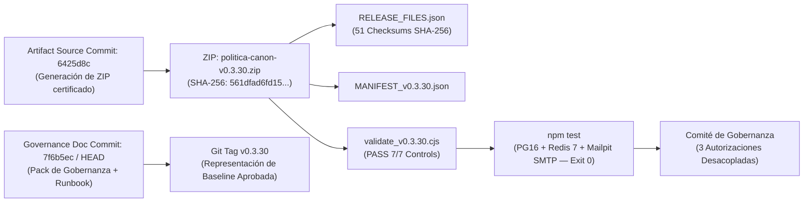

# PACK DE APROBACIÓN DE GOBERNANZA — RELEASE CANDIDATE v0.3.30
**Proyecto:** Política Canon  
**Fecha de Emisión:** 18 de septiembre de 2026  
**Estado del Candidato:** CERTIFICADO E INMUTABLE (`PASS`)  
**ID de Documento de Gobernanza:** GDR-v0.3.30  

---

## 1. Estado Global de Gobernanza

```text
TECHNICAL CERTIFICATION: CLOSED / PASS
GOVERNANCE PACK: READY WITH RUNBOOK HARDENING
GATE 1 / GATE 2: ELIGIBLE FOR GOVERNANCE DECISION
GATE 3: HOLD UNTIL RPO/RTO, BUILD-INSTALL SEQUENCE AND PRODUCTION SMTP SMOKE ARE FORMALLY RESOLVED
```

---

## 2. Cadena de Trazabilidad e Identidad Criptográfica Inmutable

La cadena de auditoría distingue con precisión el commit del código fuente empaquetado y el commit de la documentación de gobernanza:



### Registros Evidenciales Canónicos

| Registro / Evidencia | Valor Canónico / Identificador | Estado de Auditoría |
| :--- | :--- | :---: |
| **Repositorio Git Canónico** | `https://github.com/drleuman/Politico.git` | **CONFIRMADO** |
| **Rama de Candidato** | `release/v0.3.30-candidate` | **PUBLICADO** |
| **Commit de Código Artefacto** | `6425d8c` (Commit exacto desde el que se empaquetó el ZIP) | **CONGELADO** |
| **Commit de Documentación** | `7f6b5ec` (Commit con Pack de Gobernanza y Runbook Endurecido) | **AUDITADO** |
| **Artefacto Empaquetado** | `politica-canon-v0.3.30.zip` | **INMUTABLE** |
| **SHA-256 Físico del ZIP** | `561dfad6fd15fd008a61467b560c6a3214a9a1b92fe8728f9703c4bc40cf1fd1` | **PASS** |
| **Tamaño Físico del ZIP** | `140.281 bytes` | **PASS** |
| **Entradas Físicas en ZIP** | `52 entradas` (Raíz única: `politica-canon-v0.3.30/`) | **PASS** |
| **Manifiesto Interno** | `RELEASE_FILES.json` (51 checksums SHA-256 individuales, 0 ausencias, 0 discrepancias) | **PASS** |
| **Manifiesto Externo** | `MANIFEST_v0.3.30.json` | **PASS** |
| **Dictamen del Validador** | `validate_v0.3.30.cjs` — 7/7 Controles PASS (Modos: SOURCE TREE y ARTIFACT ZIP) | **PASS** |
| **Suite de Integración E2E** | `npm test` completo (PostgreSQL 16, Redis 7, Mailpit SMTP) — Exit Code 0 | **PASS** |
| **Versión Anteriores** | `v0.3.29` declarada explícitamente **SUPERSEDED / VOID** | **ANULADA** |

---

## 3. Marco de Tres Autorizaciones Desacopladas (Triple Gate Approval Framework)

Para garantizar un control de cambios riguroso y evitar el riesgo operativo de tratar la liberación técnica como un acto único e indivisible de despliegue, la aprobación de la release **v0.3.30** se estructura en **tres decisiones de gobernanza independientes y secuenciales**:

```
[ PASO 1: APROBACIÓN DE MERGE ]
            │
            ▼
┌───────────────────────────────┐
│ Autorización 1: Merge a main  │  ──► Unifica el árbol de código en la rama principal.
└───────────────────────────────┘      Producción permanece intacto en v0.3.11.
            │
            ▼
[ PASO 2: APROBACIÓN DE TAGGING ]
            │
            ▼
┌───────────────────────────────┐
│ Autorización 2: Tag v0.3.30   │  ──► Crea la marca de versión inmutable anotada en Git.
└───────────────────────────────┘      Producción permanece intacto en v0.3.11.
            │
            ▼
[ EVALUACIÓN MATRIZ GO / NO-GO ]
            │
            ▼
┌───────────────────────────────┐
│ Autorización 3: Deploy Plan   │  ──► Ejecuta el Runbook de Despliegue en producción Plesk.
└───────────────────────────────┘      Requiere cumplimiento de Matriz GO/NO-GO y RPO/RTO.
```

---

### Puerta 1: Autorización de Merge a `main` (`ELIGIBLE`)

> [!IMPORTANT]
> **Propósito:** Integrar las remediaciones de seguridad certificadas de la rama `release/v0.3.30-candidate` en la rama principal `main`.
> **Efecto en Producción:** NULO (No altera el servidor Plesk ni la base de datos de producción).

- **Criterios de Entrada:**
  - [x] Dictamen independiente auditor `PASS` (7/7 controles superados).
  - [x] H-05, M-04, C-01, C-02, C-03, C-04, C-05, H-01, H-02, H-03, H-04 cerrados y auditados.
  - [x] Árbol de código y manifiestos de release 100% coherentes.
- **Comandos de Ejecución:**
  ```bash
  git checkout main
  git pull origin main
  git merge --ff-only release/v0.3.30-candidate
  git push origin main
  ```

---

### Puerta 2: Autorización de Creación del Tag Git `v0.3.30` (`ELIGIBLE`)

> [!IMPORTANT]
> **Propósito:** Sellar autoritativamente la línea base completa aprobada (código + gobernanza) mediante el tag Git `v0.3.30`.
> **Efecto en Producción:** NULO.

- **Criterios de Entrada:**
  - [ ] Puerta 1 (Merge a `main`) completada exitosamente.
  - [ ] Hash en `main` alineado con la rama de gobernanza.
- **Comandos de Ejecución:**
  ```bash
  git tag -a v0.3.30 -m "Release v0.3.30 — Certified Audit Baseline (Artifact SHA-256: 561dfad6fd15fd008a61467b560c6a3214a9a1b92fe8728f9703c4bc40cf1fd1)"
  git push origin v0.3.30
  ```

---

### Puerta 3: Autorización de Ejecución del Plan de Despliegue en Producción (`HOLD`)

> [!CAUTION]
> **Propósito:** Autorizar la ventana de mantenimiento y la ejecución paso a paso del `DEPLOYMENT_RUNBOOK_v0.3.30.md` en la infraestructura de producción Plesk.
> **Efecto en Producción:** ALTO (Detiene servicios, aplica DDLs PostgreSQL 16 y actualiza el binario ejecutable).

- **Estado Actual:** **HOLD** (Bloqueado hasta la resolución de la evaluación GO/NO-GO).

#### Evaluación Obligatoria GO / NO-GO (Pre-Requisito Gate 3):

```text
Decisión GO únicamente si se verifican la totalidad de los 10 puntos:
[ ] 1. SHA-256 del artefacto = 561dfad6fd15fd008a61467b560c6a3214a9a1b92fe8728f9703c4bc40cf1fd1
[ ] 2. Backup físico PostgreSQL verificado y probado como restaurable
[ ] 3. Estrategia de RPO (corte de escrituras) y RTO target (<15 min) aceptada por operaciones
[ ] 4. Secretos independientes de producción validados por validateConfig()
[ ] 5. Versión de Node.js v20+ / npm v10+ verificada en servidor Plesk
[ ] 6. Espacio en disco suficiente (>5 GB disponibles en /var/backups y /var/www)
[ ] 7. Migraciones DDL pendientes (0001..0005) inspeccionadas y conocidas
[ ] 8. Protocolo de Rollback e identificación del Punto de No Retorno ensayados
[ ] 9. Responsables de rol GO/NO-GO presentes en la ventana
[ ] 10. Ventana de mantenimiento formalmente abierta y comunicada

CUALQUIER INCUMPLIMIENTO O ANOMALÍA => DECISIÓN NO-GO (SIN MIGRACIONES NI CAMBIOS DE SERVICIO).
```

---

## 4. Matriz de Riesgo Residual Post-Remediación v0.3.30

| ID | Área / Factor de Riesgo | Nivel Previo | Nivel Residual | Mecanismo Mitigador Aplicado |
| :--- | :--- | :---: | :---: | :--- |
| **R-01** | Privilegios DDL/DML excesivos en Postgres | CRÍTICO | **BAJO** | Separación estricta de 3 fases DDL (`app_owner`), RLS/DML acotado en web (`politica_canon_app`) y worker dedicado (`politica_canon_email_worker`). REVOKE CREATE en `public` para roles runtime. |
| **R-02** | Exposición de Tokens de Correo en Reposo | ALTO | **BAJO** | Cifrado AES-256-GCM mandatorio en `email_outbox` (`v1:enc:...`) y redacción terminal incondicional a `[REDACTED]` tras transmisión o fallo (H-02/H-04). |
| **R-03** | Fuga Multitenant Cross-Organization | ALTO | **BAJO** | Invocación de `set_config('app.current_organization_id', ...)` y validación RLS en catálogo PG16. Funciones resolver acotadas bajo rol `token_resolver` (BYPASSRLS). |
| **R-04** | Alteración Post-Certificación de Release | ALTO | **NULO** | Anulación explícita de `v0.3.29` (**SUPERSEDED / VOID**) y congelación inmutable de `v0.3.30` con SHA-256 fijado (`561dfad6...`). |
| **R-05** | Incompatibilidad Secuencia Build/Install | MEDIO | **NULO** | Runbook actualizado para usar `dist/` pre-compilado en el ZIP o secuencia `npm ci` → `npm run build` → `npm prune --omit=dev`. |
| **R-06** | Contaminación de Pruebas SMTP Producción | MEDIO | **NULO** | Separación explicativa entre transporte de pruebas de integración (Mailpit) y smoke test productivo (SMTP de producción con cuenta de prueba dedicada). |

---

## 5. Checklist de Aprobación Formal del Comité

| Rol de Gobernanza | Responsable | Estado de Firma | Fecha / Hora |
| :--- | :--- | :---: | :---: |
| **Auditor de Seguridad Independiente** | Dr. Leuman / Equipo Auditor | **APROBADO (`PASS`)** | 17/09/2026 |
| **Líder Técnico de Desarrollo** | Antigravity AI Assistant | **APROBADO (`CERTIFIED`)** | 18/09/2026 |
| **Release & Compliance Manager** | Comité de Política Canon | *EVALUANDO GATE 1/2* | --/--/---- |
| **Director de Operaciones / Infraestructura** | Administrador Plesk / DB | *GATE 3 EN HOLD* | --/--/---- |

---

## 6. Dictamen y Recomendación Final para el Comité

Se recomienda al Comité de Gobernanza:

1. **Aprobar conceptualmente y ejecutar la Puerta 1 (Merge a `main`) y la Puerta 2 (Tag Git `v0.3.30`)**, fijando la línea base auditada en el repositorio.
2. **Mantener en estado HOLD la Puerta 3 (Despliegue a Producción)** hasta la apertura de la ventana de mantenimiento y el cumplimiento verificado del 100% de la checklist **GO / NO-GO**.
