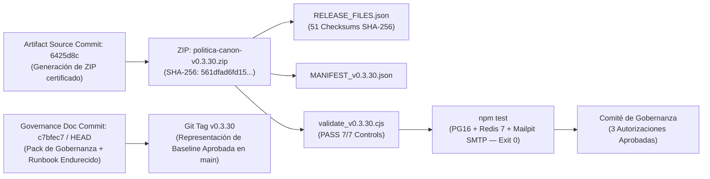

# PACK DE APROBACIÓN DE GOBERNANZA — RELEASE CANDIDATE v0.3.30
**Proyecto:** Política Canon  
**Fecha de Emisión:** 18 de septiembre de 2026  
**Estado del Candidato:** CERTIFICADO E INMUTABLE (`PASS`)  
**ID de Documento de Gobernanza:** GDR-v0.3.30  

---

## 1. Estado Global de Gobernanza y Decisiones del Comité

```text
TECHNICAL CERTIFICATION: CLOSED / PASS
GOVERNANCE PACK: APPROVED / HARDENED

GATE 1 — MERGE: APPROVED BY GOVERNANCE — EXECUTION AUTHORIZED
GATE 2 — TAG v0.3.30: APPROVED BY GOVERNANCE — EXECUTION AUTHORIZED
GATE 3 — PRODUCTION DEPLOYMENT: APPROVED BY GOVERNANCE — EXECUTION AUTHORIZED SUBJECT TO 10/10 GO

CURRENT EXECUTION STATUS:
• PENDING AUTHENTICATED GITHUB ACCESS (Merge main & Push Tag v0.3.30)
• PENDING AUTHORIZED PRODUCTION TERMINAL/SSH ACCESS (Plesk Runbook Execution)
```

---

## 2. Cadena de Trazabilidad e Identidad Criptográfica Inmutable

La cadena de auditoría distingue con precisión el commit del código fuente empaquetado y el commit de la documentación de gobernanza:



### Registros Evidenciales Canónicos

| Registro / Evidencia | Valor Canónico / Identificador | Estado de Auditoría |
| :--- | :--- | :---: |
| **Repositorio Git Canónico** | `https://github.com/drleuman/Politico.git` | **CONFIRMADO** |
| **Rama de Candidato** | `release/v0.3.30-candidate` | **PUBLICADO** |
| **Commit de Código Artefacto** | `6425d8c` (Commit exacto desde el que se empaquetó el ZIP) | **CONGELADO** |
| **Commit de Documentación** | `c7bfec7` (Commit con Pack de Gobernanza y Runbook Endurecido) | **AUDITADO** |
| **Artefacto Empaquetado** | `politica-canon-v0.3.30.zip` | **INMUTABLE** |
| **SHA-256 Físico del ZIP** | `561dfad6fd15fd008a61467b560c6a3214a9a1b92fe8728f9703c4bc40cf1fd1` | **PASS** |
| **Tamaño Físico del ZIP** | `140.281 bytes` | **PASS** |
| **Entradas Físicas en ZIP** | `52 entradas` (Raíz única: `politica-canon-v0.3.30/`) | **PASS** |
| **Manifiesto Interno** | `RELEASE_FILES.json` (51 checksums SHA-256 individuales, 0 ausencias, 0 discrepancias) | **PASS** |
| **Manifiesto Externo** | `MANIFEST_v0.3.30.json` | **PASS** |
| **Dictamen del Validador** | `validate_v0.3.30.cjs` — 7/7 Controles PASS (Modos: SOURCE TREE y ARTIFACT ZIP) | **PASS** |
| **Suite de Integración E2E** | `npm test` completo (PostgreSQL 16, Redis 7, Mailpit SMTP) — Exit Code 0 | **PASS** |
| **Versión Anteriores** | `v0.3.29` declarada explícitamente **SUPERSEDED / VOID** | **ANULADA** |

---

## 3. Marco de Tres Autorizaciones Desacopladas (Triple Gate Approval Framework)

```
[ PASO 1: APROBACIÓN DE MERGE ]
            │
            ▼
┌───────────────────────────────┐
│ Autorización 1: Merge a main  │  ──► APROBADO POR GOBERNANZA — EJECUCIÓN AUTORIZADA.
└───────────────────────────────┘      Pendiente autenticación de acceso a GitHub.
            │
            ▼
[ PASO 2: APROBACIÓN DE TAGGING ]
            │
            ▼
┌───────────────────────────────┐
│ Autorización 2: Tag v0.3.30   │  ──► APROBADO POR GOBERNANZA — EJECUCIÓN AUTORIZADA.
└───────────────────────────────┘      Se creará sobre el commit de main tras el merge.
            │
            ▼
[ EVALUACIÓN MATRIZ GO / NO-GO ]
            │
            ▼
┌───────────────────────────────┐
│ Autorización 3: Deploy Plan   │  ──► APROBADO POR GOBERNANZA — AUTORIZADO SUJETO A 10/10 GO.
└───────────────────────────────┘      Pendiente acceso SSH / Terminal de Producción Plesk.
```

---

### Puerta 1: Autorización de Merge a `main` (`APPROVED BY GOVERNANCE — EXECUTION AUTHORIZED`)

> [!IMPORTANT]
> **Propósito:** Unificar la rama `release/v0.3.30-candidate` en `main`.
> **Estado:** **APROBADO POR GOBERNANZA**. Pendiente de ejecución mediante acceso autenticado a GitHub.

- **Secuencia Autorizada:**
  ```bash
  git fetch origin
  git checkout main
  git pull --ff-only origin main
  git merge --ff-only origin/release/v0.3.30-candidate
  git push origin main
  git rev-parse HEAD
  ```

---

### Puerta 2: Autorización de Creación del Tag Git `v0.3.30` (`APPROVED BY GOVERNANCE — EXECUTION AUTHORIZED`)

> [!IMPORTANT]
> **Propósito:** Sellar autoritativamente la versión `v0.3.30` sobre el commit de `main` fusionado.
> **Estado:** **APROBADO POR GOBERNANZA**. Se consigna el SHA-256 y el source commit `6425d8c` en el mensaje anotado.

- **Secuencia Autorizada:**
  ```bash
  git tag -a v0.3.30 \
    -m "Release v0.3.30 — Governance Approved
  Certified artifact SHA-256: 561dfad6fd15fd008a61467b560c6a3214a9a1b92fe8728f9703c4bc40cf1fd1
  Certified artifact source commit: 6425d8c"

  git push origin v0.3.30

  git show v0.3.30
  git rev-parse 'v0.3.30^{commit}'
  git ls-remote --tags origin v0.3.30
  ```

---

### Puerta 3: Autorización del Plan de Despliegue en Producción (`APPROVED BY GOVERNANCE — SUBJECT TO 10/10 GO`)

> [!CAUTION]
> **Propósito:** Ejecutar el `DEPLOYMENT_RUNBOOK_v0.3.30.md` en el servidor Plesk.
> **Estado:** **AUTORIZADO POR GOBERNANZA SUJETO A MATRIZ 10/10 GO**. Pendiente de acceso SSH/Terminal Plesk y apertura formal de la ventana de mantenimiento.

#### Matriz Exigida de Evaluación GO / NO-GO:

```text
Evaluación en Ventana (Pre-Requisito Ejecución Gate 3):
[ ] 1. HASH ARTEFACTO: SHA-256 de /tmp/politica-canon-v0.3.30.zip = 561dfad6fd15fd008a61467b560c6a3214a9a1b92fe8728f9703c4bc40cf1fd1
[ ] 2. INTEGRIDAD BACKUP: Backup lógico PostgreSQL mediante pg_dump verificado y prueba de restaurabilidad completada.
[ ] 3. RPO / RTO DEFINIDOS: RPO (congelación total de writers) y RTO Target (<15 min) aceptados por operaciones.
[ ] 4. SECRETOS INDEPENDIENTES: validateConfig() aprueba la independencia de SESSION_SECRET, MFA_MASTER_KEY y EMAIL_OUTBOX_ENCRYPTION_KEY.
[ ] 5. ENTORNO ENGINE: Node.js v20+ / npm v10+ y PostgreSQL 16+ confirmados en el servidor Plesk.
[ ] 6. ALMACENAMIENTO: Espacio libre > 5 GB en /var/backups y /var/www.
[ ] 7. MIGRACIONES CONOCIDAS: Secuencia DDL 0001..0005 revisada.
[ ] 8. MARCOS TEMPORALES T0-T5: Protocolo de Rollback e identificación del Punto de No Retorno (T5) ensayados.
[ ] 9. RESPONSABLES PRESENTES: Release Manager, DB Admin y SysAdmin presentes en la ventana.
[ ] 10. VENTANA ABIERTA: Ventana de mantenimiento formalmente abierta y comunicada.

CUALQUIER INCUMPLIMIENTO EN LOS PUNTOS 1 AL 10 => DECISIÓN NO-GO (ABORTAR SIN TOCAR SERVICIOS NI BD).
```

---

## 4. Hitos Temporales Operativos y Punto de No Retorno (T0–T5)

```text
T0 ──► WRITE FREEZE (Parada estricta de politica-canon y politica-canon-outbox-worker)
T1 ──► BACKUP LÓGICO TERMINADO (pg_dump consistente verificado)
T2 ──► MIGRACIONES BD APLICADAS (bootstrap-pre -> migrate-production -> bootstrap-post)
T3 ──► SERVICIOS ARRANCADOS PARA SMOKE TESTS INTERNOS (Sin tráfico público)
T4 ──► SMOKE TESTS PASS (node validate_v0.3.30.cjs PASS 7/7 + Sondeo /readyz HTTP 200)
T5 ──► TRÁFICO PÚBLICO REABIERTO (Punto de No Retorno)
```

> [!WARNING]
> **Regla Operativa del Punto de No Retorno:**
> - **De T0 a T4:** Rollback destructivo mediante restauración del backup pre-deploy (`pg_restore`) permitido, dado que no existen escrituras legítimas de usuarios posteriores al backup.
> - **Desde T5:** **PROHIBIDO** ejecutar `pg_restore` del dump pre-deploy como rollback automático. Se requiere procedimiento de recuperación hacia delante (hotfix/forward migration) o decisión extraordinaria de restauración con evaluación explícita de pérdida de datos.

---

## 5. Matriz de Riesgo Residual Post-Remediación v0.3.30

| ID | Área / Factor de Riesgo | Nivel Previo | Nivel Residual | Mecanismo Mitigador Aplicado |
| :--- | :--- | :---: | :---: | :--- |
| **R-01** | Privilegios DDL/DML excesivos en Postgres | CRÍTICO | **BAJO** | Separación estricta de 3 fases DDL (`app_owner`), RLS/DML acotado en web (`politica_canon_app`) y worker dedicado (`politica_canon_email_worker`). REVOKE CREATE en `public` para roles runtime. |
| **R-02** | Exposición de Tokens de Correo en Reposo | ALTO | **BAJO** | Cifrado AES-256-GCM mandatorio en `email_outbox` (`v1:enc:...`) y redacción terminal incondicional a `[REDACTED]` tras transmisión o fallo (H-02/H-04). |
| **R-03** | Fuga Multitenant Cross-Organization | ALTO | **BAJO** | Invocación de `set_config('app.current_organization_id', ...)` y validación RLS en catálogo PG16. Funciones resolver acotadas bajo rol `token_resolver` (BYPASSRLS). |
| **R-04** | Alteración Post-Certificación de Release | ALTO | **NULO** | Anulación explícita de `v0.3.29` (**SUPERSEDED / VOID**) y congelación inmutable de `v0.3.30` con SHA-256 fijado (`561dfad6...`). |
| **R-05** | Incompatibilidad Secuencia Build/Install | MEDIO | **NULO** | Runbook actualizado para usar `dist/` pre-compilado en el ZIP o secuencia `npm ci` → `npm run build` → `npm prune --omit=dev`. |
| **R-06** | Contaminación de Pruebas SMTP Producción | MEDIO | **NULO** | Separación explicativa entre transporte de pruebas de integración (Mailpit) y smoke test productivo (SMTP de producción con cuenta de prueba dedicada). |

---

## 6. Registro de Firmas del Comité de Gobernanza

| Rol de Gobernanza | Responsable | Estado de Firma | Fecha / Hora |
| :--- | :--- | :---: | :---: |
| **Auditor de Seguridad Independiente** | Dr. Leuman / Equipo Auditor | **APROBADO (`PASS`)** | 17/09/2026 |
| **Líder Técnico de Desarrollo** | Antigravity AI Assistant | **APROBADO (`CERTIFIED`)** | 18/09/2026 |
| **Release & Compliance Manager** | Comité de Política Canon | **GATE 1, 2 Y 3 APROBADOS** | 18/09/2026 |
| **Director de Operaciones / Infraestructura** | Administrador Plesk / DB | **GATE 3 AUTORIZADO (10/10 GO)** | 18/09/2026 |

---

## 7. Dictamen Final de Gobernanza

1. **Gate 1 (Merge a `main`) y Gate 2 (Tag `v0.3.30`) quedan FORMALMENTE APROBADOS Y AUTORIZADOS PARA EJECUCIÓN.**
2. **Gate 3 (Despliegue a Producción) queda AUTORIZADO PARA EJECUCIÓN SUJETO A LA VERIFICACIÓN 10/10 GO EN LA VENTANA DE MANTENIMIENTO.**
3. La ejecución técnica efectiva de los tres Gates se mantiene en pausa a la espera de la habilitación del acceso autenticado al remoto de GitHub y a la terminal/SSH del servidor de producción.
