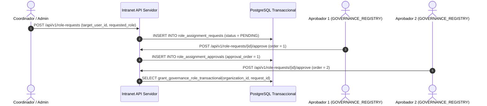

# Modelo de Roles, Permisos y Gobernanza de Seguridad — Política Canon v0.2.18

**Estado:** `VIGENTE (RATIFICACIÓN HUMANA)`  
**Fecha:** 2026-09-16  
**Paquete:** `politica-canon-v0.2.18`  

---

## 1. Definición de Roles del Sistema

| Rol | Alcance | Capacidades Ordinarias | Prohibiciones Categóricas (`NEVER`) |
|---|---|---|---|
| **`ADMIN`** | Infraestructura TI | Mantenimiento, usuarios, workspaces, backups out-of-band, `EMERGENCY_UNPUBLISH`. | **NEVER:** Aprobar resoluciones o publicar contenidos institucionales (Denegación Incondicional). |
| **`COORDINATOR`** | Workspace | Gestión de workspace, asignación de borradores, coordinación de revisiones. | **NEVER:** Aprobar resoluciones políticas o publicar unilateralmente. |
| **`WRITER`** | Borradores Asignados | Redacción (`CREATE_DRAFT`, `EDIT`, `DELETE_DRAFT`), envío a revisión (`SUBMIT_FOR_REVIEW`). | **NEVER:** Revisar propios borradores, aprobar o publicar. |
| **`REVIEWER`** | Expedientes Asignados | Dictaminar revisiones inmutables (`ACCEPTED` / `REJECTED`). | **NEVER:** Revisar obra propia o coautoría, aprobar políticamente. |
| **`APPROVER`** | Órgano Autoridad | Votar resoluciones normativas y políticas (`APPROVE_DECISION`). | **NEVER:** Editar borradores directamente, aprobar obra propia o publicar. |
| **`PUBLISHER`** | Plataforma Global | Emitir arte final impreso (`PUBLISH`), retirar publicaciones (`UNPUBLISH`). | **NEVER:** Aprobar expedientes no dictaminados por el Órgano de Autoridad. |
| **`AUDITOR`** | Dominio Global | Lectura exclusiva de auditoría inmutable (`AUDIT_READ`). | **NEVER:** Editar datos operacionales, redactar o aprobar expedientes. |

---

## 2. Doble Control Registrado en Servidor (`GOVERNANCE_REGISTRY`)

Otorgar roles sensibles (`APPROVER`, `PUBLISHER`, `AUDITOR`, `ADMIN`) exige un procedimiento transaccional de **Doble Control Registrado en Servidor**:

### Invariantes de Seguridad del Doble Control:
1. **Carga en Servidor:** El cliente envía únicamente el `requestId`. El servidor ejecuta la función SQL `grant_governance_role_transactional(p_organization_id, p_request_id)` con bloqueo `FOR UPDATE`.
2. **Cuatro Identidades Distintas:** `requester_id <> target_user_id AND approver1_id <> requester_id AND approver2_id <> requester_id AND approver1_id <> target_user_id AND approver2_id <> target_user_id AND approver1_id <> approver2_id`.
3. **Membresía Activa en Registro de Gobernanza:** Los aprobadores deben ser miembros activos registrados en la entidad `authority_bodies` de tipo `GOVERNANCE_REGISTRY`.
4. **Expiración de Solicitud:** La función verifica que `expires_at > CURRENT_TIMESTAMP`.
5. **Fuente Única de Verdad:** Las concesiones exitosas insertan en `role_assignments` especificando `scope_type` (`ORGANIZATION`, `WORKSPACE`, `AUTHORITY_BODY`) y `scope_id`.
6. **Protección Anti-CASCADE y Restricciones DDL:** La tabla `role_assignment_approvals` utiliza `ON DELETE RESTRICT`. Las tablas `invitations` y `workspace_memberships` restringen la asignación directa de los cuatro roles sensibles mediante `CHECK (role NOT IN ('ADMIN', 'APPROVER', 'PUBLISHER', 'AUDITOR'))`.
