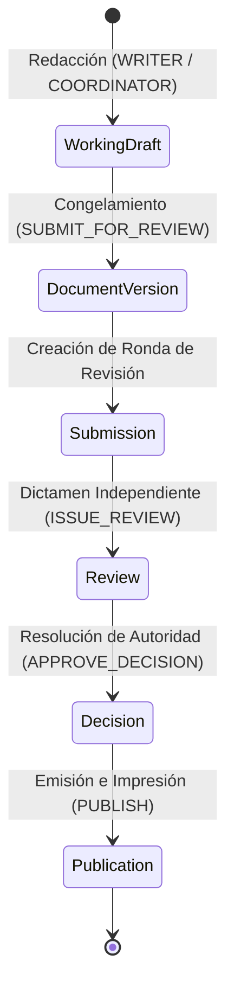

# Flujo Editorial, Ciclo de Vida y Publicación — Política Canon v0.2.18

**Estado:** `VIGENTE (RATIFICACIÓN HUMANA)`  
**Fecha:** 2026-09-16  
**Paquete:** `politica-canon-v0.2.18`  

---

## 1. Ciclo de Vida Documental y Rondas de Envío (`submissions`)

El flujo editorial sigue una secuencia causal estricta dividida en 6 etapas:

### Detalle de Etapas y Entidades:

1. **`working_drafts` (Borrador):** Mutable. Soporta Control Optimista de Concurrencia (`revision_number`) y comentarios anclados (`draft_comments`).
2. **`document_versions` (Versión Inmutable):** Se congela al solicitar revisión. Se calcula el `content_hash` SHA-256 sobre el AST JSON. Restricción unique `(organization_id, document_id, version_number)`.
3. **`submissions` (Ronda de Envío):** Entidad `submissions` que gestiona las rondas de revisión solicitadas con FK compuesta `(organization_id, document_id, version_id)`.
4. **`reviews` (Dictamen de Revisión):** Emisión de revisión inmutable por un `REVIEWER` independiente (`ACCEPTED` o `REJECTED`) ligada por FKs compuestas a la versión y la submission.
5. **`decisions` (Resolución de Autoridad):** Votación formal y resolución de aprobación por el Órgano de Autoridad (`authority_bodies`).
6. **`publications` & `publication_events` (Publicación e Impresión):** Artefacto impreso (`PDF`, `HTML`, `EPUB`, `DOCX`) con registro append-only de procedencia (`publication_events`). Claves compuestas multi-tenant exactas garantizan que la publicación refiera únicamente a decisiones aprobadas para la misma versión. Invalidaciones registradas en `document_invalidations`.

---

## 2. Registro de Procedencia de Publicación (`publication_events`)

Toda emisión, retiro o sustitución genera una entrada inmutable en `publication_events`:

| Campo | Restricción / Tipo | Descripción |
|---|---|---|
| `organization_id` | `UUID NOT NULL` | Ámbito de organización. |
| `publication_id` | `FK Compuesta (organization_id, publication_id)` | Referencia a la publicación activa. |
| `event_type` | `PUBLISH`, `WITHDRAW`, `REPLACE` | Tipo de evento de procedencia. |
| `decision_id` | `FK Compuesta (organization_id, decision_id)` | Referencia a la resolución aprobada del Órgano de Autoridad. |
| `artifact_key` | `VARCHAR(512)` (NOT NULL en `PUBLISH`) | Clave de almacenamiento del binario impreso. |
| `content_hash` | `CHAR(64) NOT NULL` | Hash SHA-256 del AST estructurado fuente. |
| `artifact_hash` | `CHAR(64)` (NOT NULL en `PUBLISH`) | Hash SHA-256 del binario impreso (distinto de `content_hash`). |
| `format` | `PDF`, `HTML`, `EPUB`, `DOCX` | Formato del artefacto impreso. |
| `template_version` | `VARCHAR(50) NOT NULL` | Versión de la plantilla gráfica. |
| `renderer_version` | `VARCHAR(50) NOT NULL` | Versión del motor renderizador (Chromium v128.0 o librería nativa). |
| `render_params` | `JSONB NOT NULL` | Parámetros JSON de impresión (márgenes, fuentes, metadatos). |
| `reason` | `TEXT` (NOT NULL en `WITHDRAW` y `REPLACE`) | Motivo de retiro o sustitución. |
| `replaced_publication_id` | `FK Compuesta (organization_id, id)` | Referencia a la publicación sustituida (NOT NULL en `REPLACE`). |
