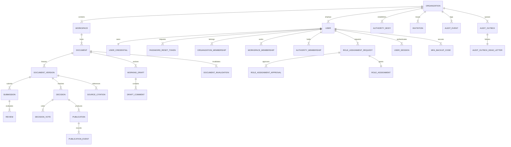

# Modelo Entidad-Relación y Esquema DDL Físico — Política Canon v0.2.18

**Estado:** `VIGENTE (RATIFICACIÓN HUMANA)`  
**Fecha:** 2026-09-16  
**Paquete:** `politica-canon-v0.2.18`  

---

## 1. Modelo Conceptual (30 Entidades Únicas)



---

## 2. Esquema DDL Físico Executable (30 Tablas en PostgreSQL 16+)

> El archivo de migración SQL ejecutable completo se encuentra en:
> [`db/migrations/0001_initial_schema.sql`](../../db/migrations/0001_initial_schema.sql)
> El provisioning seguro de roles sin contraseñas versionadas se encuentra en:
> [`db/bootstrap_roles.sql`](../../db/bootstrap_roles.sql)

```sql
-- TABLAS Y RESTRICCIONES CLAVE (V0.2.15)

-- 8. MEMBRESÍAS DE WORKSPACE (Restricción de roles sensibles directos)
CREATE TABLE workspace_memberships (
    organization_id UUID NOT NULL,
    workspace_id UUID NOT NULL,
    user_id UUID NOT NULL REFERENCES users(id) ON DELETE RESTRICT,
    role user_role_enum NOT NULL,
    is_active BOOLEAN NOT NULL DEFAULT TRUE,
    valid_from TIMESTAMPTZ NOT NULL DEFAULT NOW(),
    valid_until TIMESTAMPTZ,
    PRIMARY KEY (organization_id, workspace_id, user_id),
    FOREIGN KEY (organization_id, workspace_id) REFERENCES workspaces(organization_id, id) ON DELETE RESTRICT,
    FOREIGN KEY (organization_id, user_id) REFERENCES organization_memberships(organization_id, user_id) ON DELETE RESTRICT,
    CONSTRAINT check_ws_direct_role CHECK (role NOT IN ('ADMIN', 'APPROVER', 'PUBLISHER', 'AUDITOR'))
);

-- 24. ASIGNACIÓN EFECTIVA Y PERSISTENTE DE ROLES (Fuente de verdad unificada)
CREATE TABLE role_assignments (
    id UUID PRIMARY KEY DEFAULT gen_random_uuid(),
    organization_id UUID NOT NULL REFERENCES organizations(id) ON DELETE RESTRICT,
    scope_type scope_type_enum NOT NULL DEFAULT 'WORKSPACE',
    scope_id UUID NOT NULL,
    target_user_id UUID NOT NULL REFERENCES users(id) ON DELETE RESTRICT,
    assigned_role user_role_enum NOT NULL,
    request_id UUID REFERENCES role_assignment_requests(id) ON DELETE RESTRICT,
    is_active BOOLEAN NOT NULL DEFAULT TRUE,
    granted_at TIMESTAMPTZ NOT NULL DEFAULT NOW(),
    valid_from TIMESTAMPTZ NOT NULL DEFAULT NOW(),
    valid_until TIMESTAMPTZ,
    granted_by UUID REFERENCES users(id) ON DELETE RESTRICT,
    FOREIGN KEY (organization_id, request_id) REFERENCES role_assignment_requests(organization_id, id) ON DELETE RESTRICT
);
```

---

## 3. Políticas de Row-Level Security (RLS) en las 25 Tablas Tenant-Scoped

> Ver las 25 sentencias `CREATE POLICY tenant_isolation_policy ON ... USING (...) WITH CHECK (...)` en:
> [`db/migrations/0001_initial_schema.sql`](../../db/migrations/0001_initial_schema.sql#L315-L355)

---

## 4. Función Transaccional de Doble Control (`grant_governance_role_transactional`)

> Ver función transaccional completa con bloqueo `FOR UPDATE`, 4 identidades, verificación de `GOVERNANCE_REGISTRY` y emisión atómica de outbox en:
> [`db/migrations/0001_initial_schema.sql`](../../db/migrations/0001_initial_schema.sql#L356-L490)

---

## 5. Disparadores Anti-CASCADE de Inmutabilidad y Verificador SQL

> Ver los 9 disparadores anti-CASCADE y la función `verify_audit_chain(organization_id)` en:
> [`db/migrations/0001_initial_schema.sql`](../../db/migrations/0001_initial_schema.sql#L491-L525)
