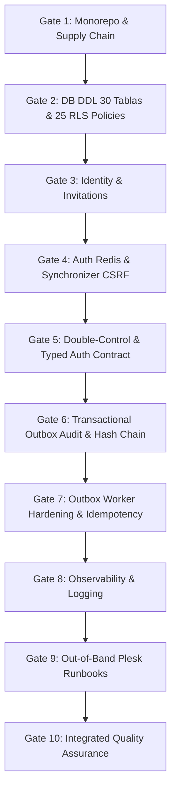

# Backlog de Trabajo de Fase 1 (Fundación Técnica) — Política Canon v0.2.18

**Estado:** `DESBLOQUEADO (DICTAMEN DE AUDITORÍA EXTERNA: PASS FORMAL)`  
**Fecha:** 2026-09-16  
**Paquete:** `politica-canon-v0.2.18`  

---

## 1. Cadena de Dependencias Estrictamente Secuencial

> [!IMPORTANT]
> Las 10 Puertas de Calidad de la Fase 1 deben ejecutarse en un orden **estrictamente secuencial** (Gate $N \to \text{Gate } N+1$). Ninguna puerta puede iniciarse antes de superar los criterios de aceptación y las pruebas automatizadas de la puerta precedente.

---

## 2. Detalle de Puertas de Calidad (Historias 1.1 a 10.1)

### Gate 1: Supply Chain & Monorepo Foundation
- **Historia 1.1:** Inicializar monorepo TypeScript (Fastify + Vite) con `npm clean-install` reproducible y fijación estricta de dependencias.
  - **Criterios de Aceptación:** Monorepo compila con 0 advertencias TypeScript en modo estricto. Lockfile cerrado.
  - **Definition of Done (DoD):** CI pasa en verde con validación de tipos e higiene de dependencias.

### Gate 2: Base de Datos PostgreSQL 16+ & RLS Multi-tenant
- **Historia 2.1:** Implementar el esquema DDL físico de 30 tablas en Drizzle ORM ([`ERD.md`](../architecture/ERD.md)) imponiendo claves compuestas `organization_id`, restricciones `ON DELETE RESTRICT` y 25 políticas **Row-Level Security (RLS)** explícitas en PostgreSQL 16+.
  - **Criterios de Aceptación:** 30 tablas creadas, 25 políticas `USING`/`WITH CHECK` activas y ejecutables.
  - **Definition of Done (DoD):** Pruebas de migración desde cero y rollback ejecutadas limpiamente. Matriz de aislamiento tenant con 2 organizaciones ejecutada en CI.

### Gate 3: Identidad, Credenciales & Sistema de Invitaciones
- **Historia 3.1:** Implementar tablas `user_credentials` (Argon2id), `invitations` con tokens de un solo uso de alta entropía y `password_reset_tokens`.
  - **Criterios de Aceptación:** Restricción SQL `CHECK (role NOT IN ('ADMIN', 'APPROVER', 'PUBLISHER', 'AUDITOR'))` en `invitations`.
  - **Definition of Done (DoD):** Pruebas unitarias de hashing de contraseñas y consumo de invitaciones superadas.

### Gate 4: Autenticación Redis Core & Synchronizer Token CSRF
- **Historia 4.1:** Implementar tienda autoritativa de sesiones opacas en Redis con Fail-Closed (`503`), revocación indexada `user_sessions:<user_id>`, TOTP MFA (<15 min) y middleware *Synchronizer Token Pattern* para `X-CSRF-Token`.
  - **Criterios de Aceptación:** Fail-closed `503` ante caída de Redis. Rechazo de peticiones mutativas sin CSRF.
  - **Definition of Done (DoD):** Pruebas de integración de sesión, expiración y mitigación CSRF ejecutadas al 100%.

### Gate 5: Contrato de Autorización & Doble Control en Servidor
- **Historia 5.1:** Implementar `evaluateAuthorizationContract` ([`AUTHORIZATION_MATRIX.md`](../security/AUTHORIZATION_MATRIX.md)) con denegación incondicional del Admin y la función SQL transaccional `grant_governance_role_transactional(organization_id, request_id)` con 4 identidades distintas y verificación de `GOVERNANCE_REGISTRY`.
  - **Criterios de Aceptación:** DTO no acepta banderas de confianza del cliente. Denegación incondicional comprobada en Admin. Lectura pública anónima permitida sin org ID.
  - **Definition of Done (DoD):** Suite de pruebas unitarias TypeScript de matriz de autorización ejecutada con 100% de éxito.

### Gate 6: Auditoría Transactional Outbox, Lock Consultivo & Dead-Letter Queue
- **Historia 6.1:** Implementar auditoría append-only ([`ADR-0003`](../adr/ADR-0003-audit-logging-and-outbox.md)) con `sequence_number` por org, `pg_advisory_xact_lock`, Genesis Hash (64 ceros), canonicalización JSON JCS RFC 8785, outbox atómico e idempotencia via `outbox_id UNIQUE` y `audit_outbox_dead_letter`.
  - **Criterios de Aceptación:** Firma hash chain correcta. Composite FK `(organization_id, outbox_id)` impuesta en DDL.
  - **Definition of Done (DoD):** Pruebas atómicas de inserción de outbox en transacción de negocio.

### Gate 7: Endurecimiento de Worker Outbox e Idempotencia
- **Historia 7.1:** Implementar worker asíncrono outbox con `FOR UPDATE SKIP LOCKED`, leasing recuperable (`claimed_at + lease_duration`), reintentos con `retry_count >= 0` y verificador de cadena `verify_audit_chain`.
  - **Criterios de Aceptación:** Sin duplicación de eventos de auditoría bajo alta concurrencia.
  - **Definition of Done (DoD):** Pruebas de estrés de worker concurrente con recuperación de fallos.

### Gate 8: Observabilidad & Métricas de Salud
- **Historia 8.1:** Implementar registros estructurados en JSON, métricas de rendimiento y verificación de salud de Redis y PostgreSQL.
  - **Criterios de Aceptación:** Endpoints `/health` y `/metrics` activos.
  - **Definition of Done (DoD):** Logs JSON sanitizados sin exposición de credenciales o tokens.

### Gate 9: Runbooks CLI Out-of-Band para Restauración en Plesk
- **Historia 9.1:** Crear scripts CLI de administración out-of-band para backup y restauración en servidor Plesk/Docker, manteniendo `SCR-23` exclusivamente como panel de salud de solo lectura.
  - **Criterios de Aceptación:** Runbooks probados en entorno PostgreSQL 16+.
  - **Definition of Done (DoD):** Pruebas de restauración midiendo RTO (<15 min) y RPO (0 pérdida en transacciones confirmadas).

### Gate 10: Pruebas Integradas de Cierre de Fase 1
- **Historia 10.1:** Ejecutar suite de pruebas de estrés para carreras concurrentes de auditoría, pruebas negativas cross-tenant y validación de cobertura al 100% de los criterios de la Fundación de Fase 1.
  - **Criterios de Aceptación:** Cobertura de pruebas > 90%, 0 vulnerabilidades críticas.
  - **Definition of Done (DoD):** Reporte automatizado de cierre de Fase 1 generado y validado.
